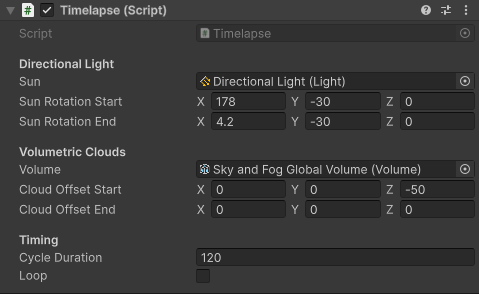

# UnityTimelapse

Simple script designed to quickly create timelapses in Unity HDRP. Ideal for **presenting scenes, cinematics, or testing lighting variations** without using Timeline. **Version 0.1.0** -> Has only a directional light rotation and volumetric cloud offset animation.

> 🛠️ This project is made/test under Unity 6.1 (6000.1.12f1)

[**Download the latest version here**](Runtime/Timelapse.cs)

## Features:
- Interpolated sun rotation (Directional Light)
- Volumetric Clouds offset animation
- Customizable duration, loop option

> Unity Volumetric Clouds is required (HDRP)

---

  

---

## 🛠 How to Use:

- Copy the `Timelapse.cs` script into your Unity project.
- Make sure you're using **HDRP** with **Volumetric Clouds enabled**.

## Setup

1. Create an empty **GameObject** and attach the script to it.
2. Assign:
    - The **Directional Light** (the sun)
    - The **HDRP Volume** containing the *Volumetric Clouds* component

3. Define:
    - `Sun Rotation Start` and `Sun Rotation End` (in degrees, Euler)
    - `Cloud Offset Start` and `Cloud Offset End`
    - `Cycle Duration` in seconds
    - Enable/disable `Loop` as needed

---

## 🔮 Roadmap (v0.2.x → v1.0.0)

- **Multi-element Control:**
    - Fog (density, color)
    - Lens Flare size/intensity
    - Water (orientation, speed, reflection parameters)

- **Object Management:**
    - Enable/disable objects at specific times
    - E.g., disable fill lights after a certain offset

- **Advanced Options :**
    - Ping-pong (back and forth)
    - Separate timers (clouds ≠ sun)
    - Custom curves (non-linear)
    - Custom editor (cleaner interface in the Inspector)

- **Official Unity package**
    - UPM structure (`package.json`)
    - Demo scene + presets
    - Asset Store release (v1.0.0)

---

## 🤝 Contact:
For issues, suggestions, or contributions, feel free to open an issue on the GitHub repository.
